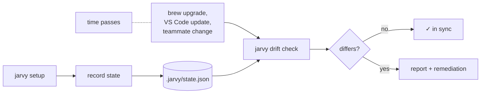
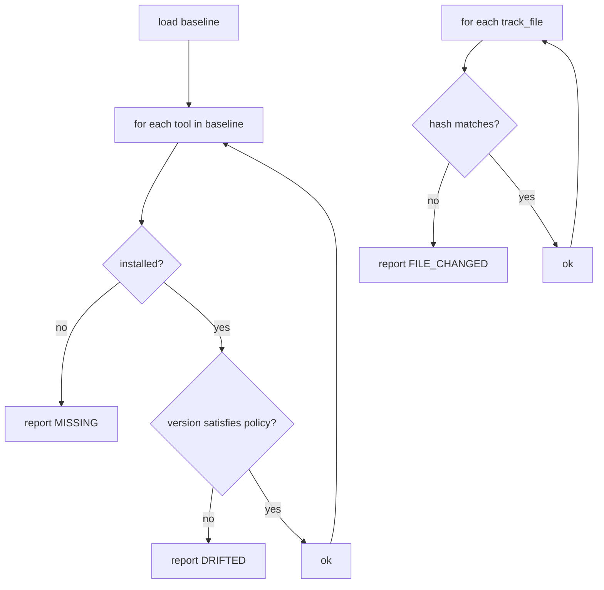

# Concept: drift baseline

A **baseline** is the snapshot Jarvy takes after a successful `jarvy setup`. It records exactly which versions were installed, where they came from, and the hashes of any files you asked to track. Later, `jarvy drift check` compares the current machine to that baseline and tells you whether the environment has drifted.



---

## What's in `.jarvy/state.json`

Conceptually:

```json
{
  "version": "1",
  "config_hash": "sha256:...",
  "tools": {
    "node": {
      "version": "20.11.0",
      "path": "/opt/homebrew/bin/node",
      "install_method": "brew"
    }
  },
  "files": {
    ".vscode/settings.json": "sha256:...",
    "package.json": "sha256:..."
  },
  "created_at": "...",
  "updated_at": "..."
}
```

| Field | What it pins | Why it's there |
|---|---|---|
| `config_hash` | A hash of the resolved `jarvy.toml` | Detects "the config itself changed" before pointing fingers at the machine. |
| `tools[name].version` | Exact version | The fundamental drift check. |
| `tools[name].path` | Absolute path | Catches the case where a tool moved between Homebrew and a system package. |
| `tools[name].install_method` | `brew`, `apt`, `winget`, `binary`, … | Used by `drift fix` to remediate with the right command. |
| `files[path]` | SHA-256 hash | Catches edits to declared `track_files` (`.vscode/settings.json`, `package.json`, …). |

This file is meant to be **committed**. It's the team's shared notion of "what known-good looks like."

---

## Version policy

Not every diff is drift. A patch bump from `20.11.0` to `20.11.3` is usually fine; a major bump from `20.x` to `22.x` is not. The `[drift]` block lets you choose:

```toml
[drift]
enabled        = true
version_policy = "minor"      # major | minor | patch | exact
allow_upgrades = true         # only flag downgrades
ignore_tools   = ["vim"]      # noisy, not load-bearing
track_files    = [".vscode/settings.json"]
```

| Policy | Drift if… |
|---|---|
| `major` | Major version differs (`20.x → 22.x`). |
| `minor` *(default)* | Major or minor differs (`20.11 → 20.12` is fine; `20 → 21` is not). |
| `patch` | Any version digit differs. |
| `exact` | Including pre-release and build metadata. |

`allow_upgrades = true` is the team-friendly default — it skips warnings when a teammate is *ahead* of the baseline, only flagging when they're behind.

---

## What `jarvy drift check` actually does



Outputs come in two flavors:

- **Human:** colored table by default
- **Machine:** `--format json` for CI

Exit codes:

| Code | Meaning |
|---|---|
| 0 | No drift. |
| 1 | Drift detected. |
| 2 | No baseline. Run `jarvy drift accept` first. |

---

## Three ways to react to drift

| Command | Use when |
|---|---|
| `jarvy drift fix` | The baseline is the truth — pull the machine back. Re-runs install with the recorded version. |
| `jarvy drift fix --dry-run` | Preview the fix without touching the machine. |
| `jarvy drift accept` | The machine is the new truth — bump the baseline to current state. |
| `jarvy drift accept --tools node` | Accept just one tool, leave the rest. |

The right choice depends on context: a security patch on the laptop is `accept`; an accidental `brew upgrade` is `fix`.

---

## Drift in CI

The same exit codes that make `drift check` useful at the terminal make it useful in pipelines:

```yaml title=".github/workflows/jarvy.yml"
- run: jarvy setup
- run: jarvy drift check --format json
```

This catches the case where someone bumps `jarvy.toml` but forgets to refresh `.jarvy/state.json` — a PR that would silently re-baseline everyone else's laptop.

[CI/CD integration →](../ci-cd.md)

---

## What drift baseline does *not* do

- It doesn't track every dotfile, only the ones you list under `track_files`.
- It doesn't pin transitive package versions — `pip freeze` and `package-lock.json` are still the right tools for that. Drift baseline pins the *runtime*; lockfiles pin the *libraries*.
- It doesn't reach into `~/.gitconfig` or shell `rc` files. Use `[git]` and `[env.vars]` to declare those, then re-run `jarvy setup`.

---

## When to commit the baseline vs gitignore it

Two valid patterns:

| Pattern | When |
|---|---|
| **Commit `.jarvy/state.json`** | Most teams. Everyone targets the same machine state. PRs that bump it get reviewed. |
| **Gitignore it** | Solo projects where you only care about local consistency, not team consistency. |

For the committed pattern, `jarvy drift accept` is a deliberate act — it generates a diff that another reviewer can sanity-check.

---

## Next

- [Drift guide](../drift.md) — full TOML reference and CLI commands
- [Lifecycle](lifecycle.md) — where snapshotting fits
- [CI/CD integration](../ci-cd.md) — drift checks in pipelines
