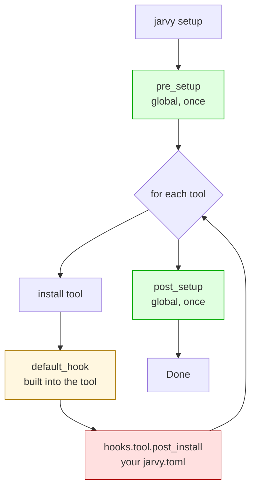

# Concept: hook execution

Hooks let you run shell scripts at specific points in the [setup lifecycle](lifecycle.md). They turn `jarvy setup` from "install tools" into "install tools + configure them + seed the project."



---

## The four hook positions

| Position | When | Scope |
|---|---|---|
| `pre_setup` | Once, before the first tool installs | Global |
| `default_hook` | After a tool installs | Per-tool, defined in the tool's recipe |
| `[hooks.<tool>] post_install` | After a tool's default hook | Per-tool, your config |
| `post_setup` | Once, after all tools and per-tool hooks finish | Global |

---

## A worked example

```toml title="jarvy.toml"
[provisioner]
node     = "20"
starship = "latest"

[hooks]
pre_setup  = "echo 'starting'"
post_setup = "make db-seed"

[hooks.node]
post_install = "npm install -g typescript"

[hooks.config]
shell             = "bash"
timeout           = 300
continue_on_error = false
```

The execution order is:

```text
1. pre_setup                    → echo 'starting'
2. install node                  (skipped if already 20.x)
3. node default_hook             (none)
4. hooks.node.post_install       → npm install -g typescript
5. install starship              (skipped if already present)
6. starship default_hook         → adds `eval "$(starship init zsh)"` to .zshrc
7. (no user hook for starship)
8. post_setup                   → make db-seed
```

---

## Default hook vs user hook

Tools can ship with a built-in `default_hook` — Starship adds shell init lines, fzf installs key bindings, mise wires `~/.bashrc`. The interaction with your config:

| Your config | Result |
|---|---|
| No `[hooks.<tool>]` | Default hook runs alone. |
| `[hooks.<tool>] post_install` with **same description** as the default | Yours **replaces** the default. |
| `[hooks.<tool>] post_install` with **different description** | Default runs first, then yours. |

To see which tools have default hooks: `jarvy tools --default-hooks`

---

## What hooks see

Every hook gets these environment variables, on top of your shell's normal env:

| Variable | Value |
|---|---|
| `JARVY_TOOL` | Tool name (per-tool hooks only) |
| `JARVY_VERSION` | Version that was installed |
| `JARVY_OS` | `macos`, `linux`, or `windows` |
| `JARVY_ARCH` | `x86_64`, `aarch64`, … |
| `JARVY_HOME` | `~/.jarvy` |

The shell defaults to `bash` on Unix and PowerShell on Windows. Override with `[hooks.config] shell = "zsh"`.

---

## Idempotency is on you

Hooks run on every `jarvy setup`. That includes re-runs by the same developer and runs by every teammate. **Write hooks that are safe to re-run** — check before you mutate.

Bad:

```bash
echo 'eval "$(starship init zsh)"' >> ~/.zshrc
```

Good:

```bash
if [ -f "$HOME/.zshrc" ] && ! grep -q 'starship init zsh' "$HOME/.zshrc"; then
    echo 'eval "$(starship init zsh)"' >> "$HOME/.zshrc"
fi
```

This is exactly how Jarvy's own default hooks are written.

---

## Timeouts and errors

```toml
[hooks.config]
shell             = "bash"     # auto-detected if omitted
timeout           = 300        # seconds; default 300
continue_on_error = false      # default; true makes failures advisory
```

| Setting | Effect |
|---|---|
| `timeout` | Hooks killed after N seconds. The tool is considered installed even if its hook timed out. |
| `continue_on_error = false` (default) | A failing hook aborts the whole `jarvy setup`. |
| `continue_on_error = true` | Failures log a warning and the next hook runs. |

Default hooks are **always advisory**, regardless of `continue_on_error` — the assumption is they're "nice to have" extras.

---

## Skipping hooks

Two CLI flags:

```bash
jarvy setup --no-hooks    # skip every hook
jarvy setup --dry-run     # print every hook command, don't run them
```

`--no-hooks` is for surgical reinstalls (the tool is fine, you just want a fresh binary). `--dry-run` is for code review and CI.

---

## Hook ordering across tools

Tools install in [topological order](tools.md#dependencies) — dependencies first. So a `[hooks.kubectl] post_install` that assumes Docker is running can rely on `docker` being installed first, as long as `kubectl` declares `depends_on_one_of: ["docker", ...]`.

---

## Anti-patterns

- **Don't `cd` to a project subdirectory in a hook** — the working directory is the repo root and your teammate's checkout layout might not match. Use `$JARVY_HOME` or absolute paths.
- **Don't write secrets into hook output** — hook stdout is logged. Use `[env.secrets]` instead.
- **Don't shell out to a tool you haven't depended on** — if a hook uses `pnpm`, declare `pnpm` in `[provisioner]` (or `[npm]` with `package_manager = "pnpm"`).
- **Don't rely on interactive prompts** — hooks run non-interactively in CI; design for unattended execution.

---

## Next

- [Hooks reference](../hooks.md) — every option in the `[hooks]` table
- [Tools](tools.md) — where `default_hook` is defined
- [Lifecycle](lifecycle.md) — where hooks fit in the eight phases
