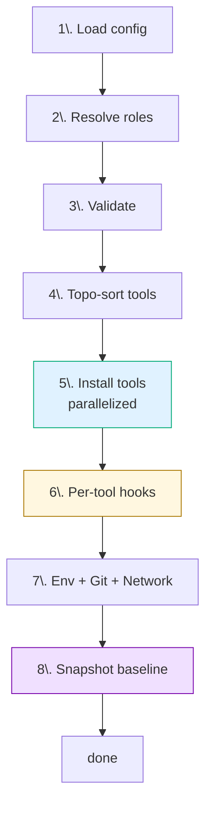
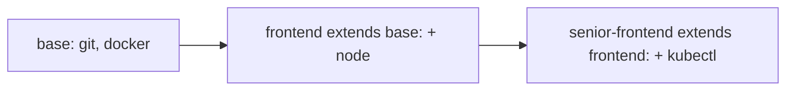
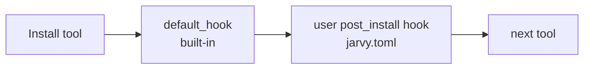

# Concept: setup lifecycle

`jarvy setup` runs through eight phases, in order, every time. Knowing the order is the key to writing hooks that fire when you expect them.



---

## 1. Load config

Jarvy looks for `jarvy.toml` starting at the current directory and walking up. `--file` overrides the search.

If `--remote` is set, the config is fetched and cached — the cache is keyed by URL hash and respects `Cache-Control` headers. Custom `--header` flags get passed through, so private GitHub raw URLs work with a token.

---

## 2. Resolve roles

If the config has a `role = "..."` key (or `role = ["a", "b"]`), Jarvy walks the inheritance chain. Each role's `tools` and version overrides are merged into a flat tool set:



**Rules:**

- Maximum 5 levels of inheritance — guards against cycles
- Direct `[provisioner]` entries always win over role tools
- For multiple roles (`role = ["a", "b"]`), later entries override earlier ones

[Roles deep dive →](roles-and-inheritance.md)

---

## 3. Validate

Schema check on the merged config. Catches:

- Unknown tool names
- Invalid version strings
- Missing required fields under `[env.secrets]`
- Conflicting role overrides

Validation is also available standalone: `jarvy validate` (or `jarvy validate --strict` to fail on warnings).

---

## 4. Topo-sort tools

Tools with `depends_on` declarations get sorted so dependencies install first. `depends_on_one_of` participates too — if one of the options is in your config, it's pulled to the front; otherwise you get an advisory warning.

[Dependency rules →](../tool-dependencies.md)

---

## 5. Install tools (parallelized)

This is the heavy lifting. Jarvy invokes the platform's package manager for each tool that isn't already installed at the right version.

**Parallelism:** controlled by `--jobs N` (default 4) for user-space installs (npm, pip, cargo, go, custom installers). System package manager calls are serialized to avoid lock contention.

**Skip path:** if `command` is on `PATH` and the version satisfies, the tool is logged as `✓ already installed` and skipped — no package manager call is made.

**Dry-run:** `jarvy setup --dry-run` prints the full plan, including the exact shell commands that would run, without executing them.

---

## 6. Per-tool hooks

After each tool installs, hooks run in this order:



- The tool's `default_hook` (if defined) runs first.
- Then your `[hooks.<tool>] post_install` runs.
- A user-defined hook with the same description as a default hook **replaces** it; otherwise both run.
- Hook env vars: `JARVY_TOOL`, `JARVY_VERSION`, `JARVY_OS`, `JARVY_ARCH`, `JARVY_HOME`.
- Default timeout: 300s. Override per hook with `[hooks.config] timeout = N`.
- Failures are advisory by default; set `[hooks.config] continue_on_error = false` to abort.

There are also two **global** hooks:

```toml
[hooks]
pre_setup  = "echo 'about to provision'"  # runs once, before any tool installs
post_setup = "make db-seed"               # runs once, after everything
```

[Hooks reference →](../hooks.md) · [Hook execution model →](hooks-execution.md)

---

## 7. Env, Git, Network

Three side-effecting steps run before the snapshot:

| Step | Source | Outputs |
|---|---|---|
| Env | `[env.vars]`, `[env.secrets]` | `.env`, shell `rc` exports, error if a required secret is missing |
| Git | `[git]` | `~/.gitconfig` or `.git/config` (per `scope`), aliases, signing |
| Network | `[network]` | Process env vars: `HTTPS_PROXY`, `NO_PROXY`, `CURL_CA_BUNDLE`, … |

[Env reference →](../configuration.md#environment-variables-env) · [Git config →](../git-config.md) · [Network →](../network.md)

---

## 8. Snapshot baseline

Jarvy records the resulting state to `.jarvy/state.json`:

- The exact installed version of each tool
- The install method that was used (`brew`, `apt`, `winget`, `binary`, …)
- SHA-256 hashes of any `track_files` entries (e.g. `package.json`, `.vscode/settings.json`)
- A SHA-256 hash of the resolved `jarvy.toml`

This is what [`jarvy drift check`](../drift.md) compares against later.

[Drift baseline concept →](drift-baseline.md)

---

## What runs *outside* of `jarvy setup`

These commands don't go through the lifecycle — they're standalone:

| Command | Purpose |
|---|---|
| `jarvy doctor` | Re-runs the validate + version check phases without installing anything. |
| `jarvy diff` | Compares config to current machine, no side effects. |
| `jarvy drift check` | Compares current machine to `.jarvy/state.json`. |
| `jarvy validate` | Schema check only. |
| `jarvy services` | Manages background services (postgres, redis) declared in `[services]`. |

---

## Failure modes & exit codes

| Code | Meaning | Common cause |
|---|---|---|
| 0 | Success | — |
| 2 | `CONFIG_ERROR` | Malformed `jarvy.toml`, unknown tool, role cycle |
| 3 | `PREREQ_MISSING` | Native package manager not present (e.g. brew on a fresh macOS) |
| 5 | `PERMISSION_REQUIRED` | sudo needed for a Linux install — Jarvy prompts unless `--ci` |

[Full error code reference →](../error-codes.md)

---

## Next

- [Tools](tools.md) — recipe shape and registry
- [Hooks execution](hooks-execution.md) — when hooks run, what env they see
- [Drift baseline](drift-baseline.md) — what gets snapshotted
