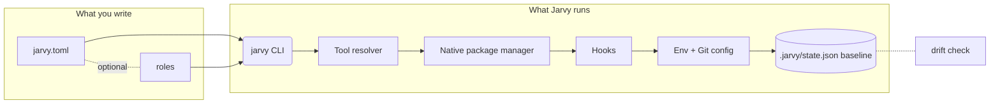
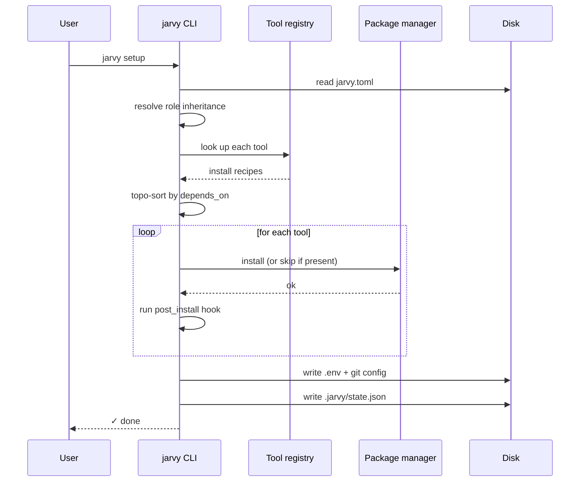

# Concepts overview

Jarvy is a small system. There are five ideas that explain everything else; once you have these five, the [reference](../configuration.md) reads itself.



| Concept | One-liner | Deep dive |
|---|---|---|
| **Config** | `jarvy.toml` is the source of truth — every option is declarative and git-versioned. | [Reference](../configuration.md) |
| **Tools** | Every tool is a recipe Jarvy knows how to install with the local package manager. | [Tools](tools.md) |
| **Lifecycle** | `jarvy setup` runs a fixed sequence — resolve, install, hook, env, snapshot. | [Lifecycle](lifecycle.md) |
| **Roles** | A role is a named bundle of tools that can extend other roles, with per-role version overrides. | [Roles](roles-and-inheritance.md) |
| **Drift baseline** | After a clean setup, Jarvy records exact versions and file hashes; later it compares. | [Drift baseline](drift-baseline.md) |

---

## How a `jarvy setup` actually flows



Every step is idempotent — running setup twice is always safe.

---

## Where things live on disk

| Path | Purpose | Versioned? |
|---|---|---|
| `jarvy.toml` | Project config — tools, hooks, roles, env. | Yes — commit to repo |
| `.jarvy/state.json` | Drift baseline — exact versions captured after `jarvy setup`. | Yes — commit to repo |
| `~/.jarvy/config.toml` | Per-machine settings: telemetry, update channel. | No — user preference |
| `~/.jarvy/logs/` | Rotated log files. | No |
| `~/.jarvy/tickets/` | Diagnostic bundles for support. | No |

---

## The five sections you'll see in every config

```toml
[provisioner]   # tools to install — see Tools concept
[hooks]         # shell scripts to run — see Lifecycle
role = "..."    # role assignment — see Roles
[env.vars]      # environment variables to write
[drift]         # baseline policy — see Drift baseline
```

Everything else (`[npm]`, `[pip]`, `[cargo]`, `[git]`, `[network]`, `[telemetry]`, `[update]`, `[services]`) is an extension of one of these five.

---

## Read these in order

1. [Tools](tools.md) — what's in the registry, how tools are resolved
2. [Lifecycle](lifecycle.md) — exact ordering of setup steps
3. [Roles & inheritance](roles-and-inheritance.md) — how role merging actually works
4. [Hooks execution](hooks-execution.md) — when hooks run, what env they see
5. [Drift baseline](drift-baseline.md) — what Jarvy snapshots and why
