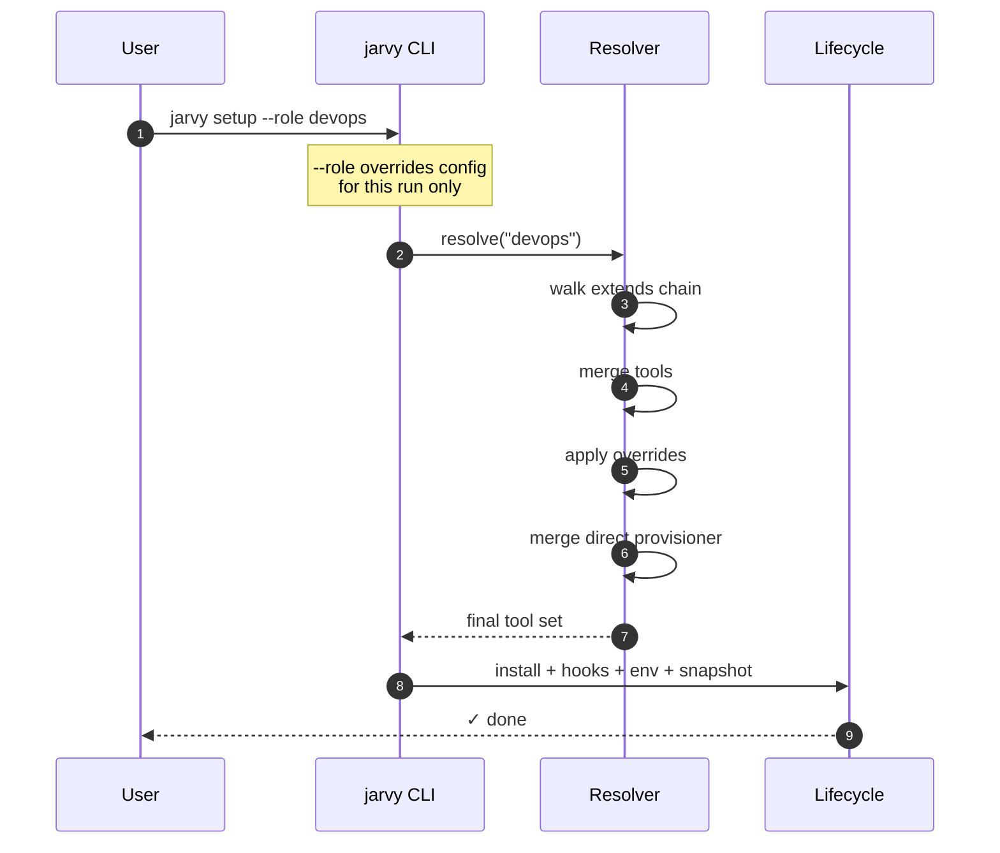

# Concept: roles & inheritance

A **role** is a named bundle of tools. Roles exist because real teams have different jobs — frontend, backend, DevOps, ML — and you don't want every laptop installing every tool.

Roles can extend other roles. A child role inherits its parent's tools, then adds, removes, or version-overrides them. The result is one merged tool set that flows into the [setup lifecycle](lifecycle.md#2-resolve-roles).

---

## A small example

```toml title="jarvy.toml"
role = "frontend"

[roles.base]
description = "Tools every contributor needs"
tools = ["git", "docker"]

[roles.frontend]
description = "Frontend developers"
extends = "base"
tools = ["node", "pnpm"]

[roles.frontend.tools]
node = "20"   # version override

[roles.senior-frontend]
extends = "frontend"
tools = ["kubectl"]
```

When a developer with `role = "frontend"` runs `jarvy setup`, they install:

```text
git, docker  (from base)
node@20, pnpm  (from frontend)
```

A developer with `role = "senior-frontend"` also gets `kubectl`.

---

## Resolution order

```mermaid
flowchart TD
    cfg[jarvy.toml on disk] --> r{role declared?}
    r -- no --> p[use only [provisioner]]
    r -- yes --> chain[walk extends chain<br/>up to 5 levels]
    chain --> merge[merge tools, child wins]
    merge --> ovr[apply version overrides]
    ovr --> direct[merge direct [provisioner]<br/>direct wins]
    direct --> final[final tool set]
```

**Precedence (last writer wins):**

1. Base role tools
2. Each ancestor role, in extends order
3. The role you're currently set to
4. **Direct `[provisioner]` entries always win** — they're the project-level override.

---

## Multiple roles

You can assign more than one role:

```toml
role = ["frontend", "devops"]
```

Roles merge left-to-right — the **last** entry wins for any conflict. Use this when one developer wears two hats.

---

## Per-role version overrides

Two ways to override a tool's version inside a role:

```toml
# Form 1: separate version table
[roles.frontend]
extends = "base"
tools = ["node"]

[roles.frontend.tools]
node = "20"

# Form 2: nested provisioner block (when you need detailed config)
[roles.frontend.provisioner]
node = { version = "20", version_manager = true }
```

---

## Disabling inherited tools

To pull a tool out of an inherited role, override it with an empty version-manager-only spec, or use `--without` at the CLI:

```bash
jarvy setup --role frontend --without docker
```

Persisting the removal in config currently means redefining the tool list at the child level.

---

## Inheritance limits

- **Maximum depth:** 5 levels. Beyond that, Jarvy aborts with a `CONFIG_ERROR` to guard against accidental cycles.
- **Cycles:** detected and rejected.
- **Missing parents:** `extends = "..."` pointing to an undefined role is a `CONFIG_ERROR`.
- **Empty roles:** allowed — useful for marker roles that exist only to gate `[hooks.<role>]`.

---

## Inspecting roles

```bash
jarvy roles list                    # roles defined in this config
jarvy roles list -v                 # tool counts per role
jarvy roles show frontend           # role details
jarvy roles show frontend --resolved      # all inherited tools
jarvy roles show frontend --inheritance   # the chain
jarvy roles diff frontend backend   # what changes between two roles
```

---

## How role choice flows through the system



`--role <name>` is **temporary** — it doesn't modify `jarvy.toml`. Use it for ad-hoc role switching; commit a `role = "..."` line to make a default stick.

---

## When *not* to use roles

If your team has one job and every laptop needs the same tools, skip roles entirely. A flat `[provisioner]` block is simpler and reads better in PRs. Add roles when you've got a real divergence — frontend vs backend, app vs platform — and the divergence is causing wasted installs or test surface area.

---

## Next

- [Roles guide](../roles.md) — full TOML reference
- [Tools](tools.md) — what each role entry refers to
- [Lifecycle](lifecycle.md) — where role resolution sits in `jarvy setup`
