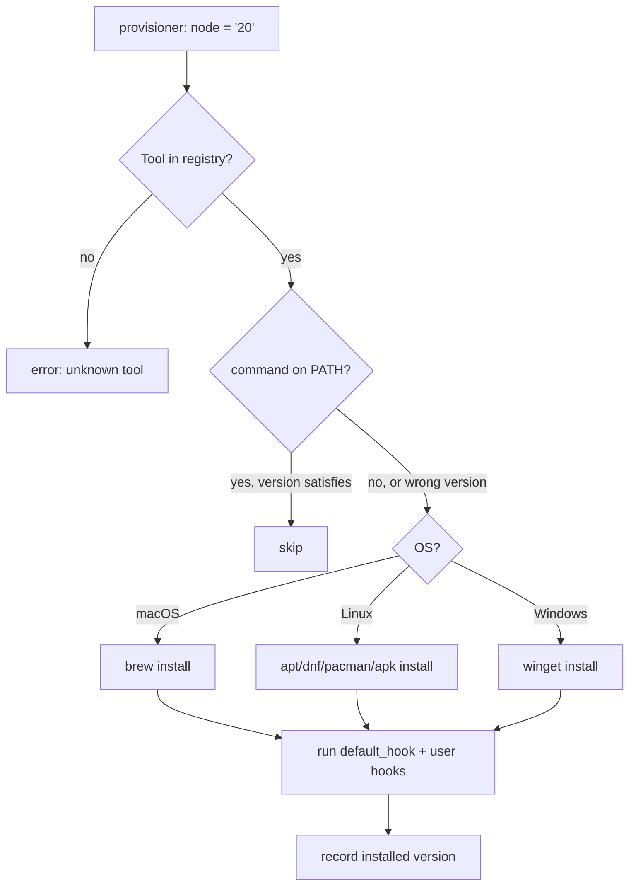
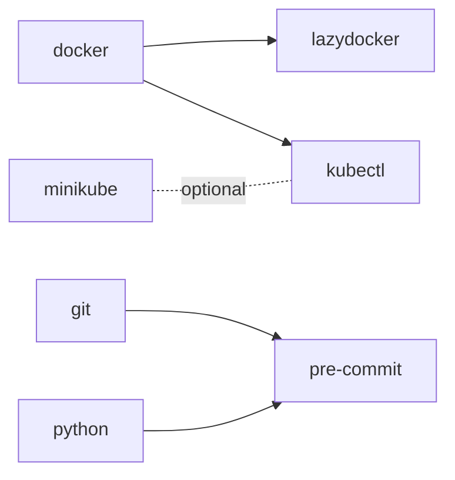

# Concept: tools

A **tool** is anything Jarvy can install. Inside Jarvy, each tool is a small declarative recipe that knows three things: how to detect itself, how to install itself per platform, and (optionally) what other tools it depends on.

---

## The shape of a tool

Every tool in the registry follows the same shape:

```rust title="src/tools/node/node.rs (simplified)"
define_tool!(NODE, {
    command: "node",
    macos:   { brew: "node" },
    linux:   { uniform: "nodejs" },
    windows: { winget: "OpenJS.NodeJS.LTS" },
    depends_on_one_of: &[],
    default_hook: { /* optional post-install setup */ },
});
```

The macro expands into a `ToolSpec` registered in the global tool registry at startup. Your `jarvy.toml` references tools by their `command` name (`node`, in this case).

| Field | What it does |
|---|---|
| `command` | The binary name Jarvy will look for on `PATH` to detect prior installs. |
| `macos`, `linux`, `windows` | Per-OS install instructions for the native package manager. |
| `linux: uniform` | One package name across apt, dnf, pacman, apk. |
| `linux: { apt: …, dnf: …, … }` | Per-distro names when they differ. |
| `depends_on` | Strict — these tools **must** be available before this tool installs. |
| `depends_on_one_of` | Flexible — at least one option must be present (e.g. kubectl needs *some* cluster provider). |
| `custom_install` | Escape hatch for tools whose package manager is itself a script (`nvm`, `rustup`, `brew`). |
| `default_hook` | Built-in post-install configuration (idempotent, advisory). |

---

## How a tool gets resolved



The check at step C is what makes `jarvy setup` idempotent. Already-correct tools never reinstall.

---

## Version requirements

`jarvy.toml` accepts six version forms:

| Form | Example | Meaning |
|---|---|---|
| `latest` | `git = "latest"` | Any version is fine. |
| Bare | `node = "20"` | Major version 20.x.x. |
| `^` | `python = "^3.10"` | Compatible: `>=3.10.0, <4.0.0`. |
| `~` | `python = "~3.12"` | Approximate: `>=3.12.0, <3.13.0`. |
| `>=` | `python = ">=3.10"` | At least this version. |
| `=` | `node = "=20.11.0"` | Exact match — for reproducibility. |

The detailed form unlocks more knobs:

```toml
[provisioner]
node = { version = "20", version_manager = true }
```

| Option | Default | Effect |
|---|---|---|
| `version` | required | Any of the version forms above. |
| `version_manager` | `true` | Use a version manager (nvm, pyenv) when one exists for this tool. |
| `use_sudo` | auto | Force sudo on or off for this single tool. |

---

## Dependencies

Tools can declare two flavors of dependency:

```rust
// Strict — Docker is required for lazydocker to run
define_tool!(LAZYDOCKER, {
    command: "lazydocker",
    depends_on: &["docker"],
    ...
});

// Flexible — kubectl needs a cluster, any cluster
define_tool!(KUBECTL, {
    command: "kubectl",
    depends_on_one_of: &["minikube", "kind", "k3d", "docker", "podman"],
    ...
});
```

When you run `jarvy setup`, dependencies drive a topological sort so things install in a workable order:



If a strict dependency is missing, you get a warning but the install proceeds (advisory, not blocking). If at least one flexible dependency is satisfied, no warning.

[Full dependency rules →](../tool-dependencies.md)

---

## Default hooks

Some tools come with a built-in `default_hook` that configures them after install — Starship adds the shell init line, fzf installs key bindings, and so on. Default hooks are:

- **Idempotent** — safe to re-run; scripts check before mutating files
- **Advisory** — failures warn and continue
- **Overridable** — your `[hooks.<tool>]` takes precedence

List every tool with a default hook:

```bash
jarvy tools --default-hooks
```

[Hooks deep dive →](../hooks.md) · [Hook execution model →](hooks-execution.md)

---

## Browsing the registry

```bash
jarvy tools                  # list every supported tool
jarvy tools --index          # JSON index, scriptable
jarvy search docker          # fuzzy search
jarvy explain kubectl        # detailed metadata for one tool
```

The registry currently ships **200+ tools** across language runtimes, build tools, cloud SDKs, container tools, security scanners, and editors.

---

## Adding a new tool

If a tool you need isn't in the registry, you can add it in ~10 lines and submit a PR. See [Adding tools](../adding-tools.md) for the macro forms, naming rules, and test harness.

---

## Next

- [Lifecycle](lifecycle.md) — what `jarvy setup` does, in order
- [Tool dependencies](../tool-dependencies.md) — full dependency rules
- [Adding tools](../adding-tools.md) — register a new tool
